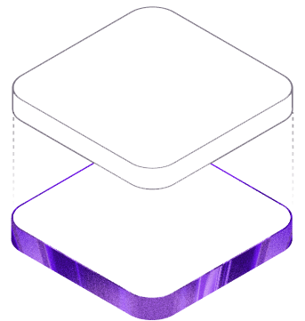

<h1 align="center">📚 Book Map</h1>
<p align="center">
  <em>Descubra o mundo através dos livros.</em>
</p>

<p align="center">
  
  
  
  
</p>

---

**Book Map** conecta literatura e geografia: pesquise um livro, selecione uma obra e veja no mapa interativo quais países do mundo falam o idioma daquela obra.



---

## ✨ Como funciona

1. **Pesquise** um livro pelo título
2. **Selecione** uma obra da lista de resultados
3. **Explore** no mapa os países que falam o idioma do livro

---

## 🚀 Rodando localmente

```bash
git clone https://github.com/EduardoTBuss/book-map.git
cd book-map
npm install
npm run dev
```

Acesse `http://localhost:5173`. Nenhuma chave de API é necessária.

---

## 🛠️ Stack

| | |
|---|---|
| UI | React 19 + Vite 8 |
| Mapa | React-Leaflet + CARTO Dark Matter tiles |
| Livros | [Open Library API](https://openlibrary.org/developers/api) |
| Países | [REST Countries API](https://restcountries.com) |
| Estilos | CSS vanilla com design tokens e dark mode |

---

## 🗂️ Estrutura

```
src/
├── components/       # SearchBar, BookList, BookDetail, MapView, ErrorMessage
├── services/         # openLibraryApi.js · restCountriesApi.js
├── utils/            # languageMap.js (ISO 639-2/B → nome por extenso)
├── App.jsx           # Componente raiz e orquestrador de estado
└── index.css         # Design tokens globais
```

---

## 🔄 Fluxo

```
busca por título
      ↓
  Open Library API  →  lista de livros com idioma (ISO 639-2)
      ↓
  languageMap.js    →  converte código para nome ("eng" → "english")
      ↓
REST Countries API  →  países que falam o idioma
      ↓
   Leaflet Map      →  markers com bandeira, capital, região e população
```

---

## 🤖 Sobre o projeto

Desenvolvido para a disciplina de **Inteligência Artificial Aplicada**, onde exploramos o uso de IA generativa como ferramenta de desenvolvimento — uma prática chamada de *vibe coding*. O objetivo é aprender a colaborar com IA para construir produtos funcionais de forma rápida e iterativa, desde o design até a entrega.

---

## 📄 Licença

MIT
